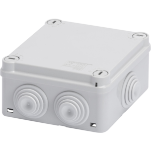
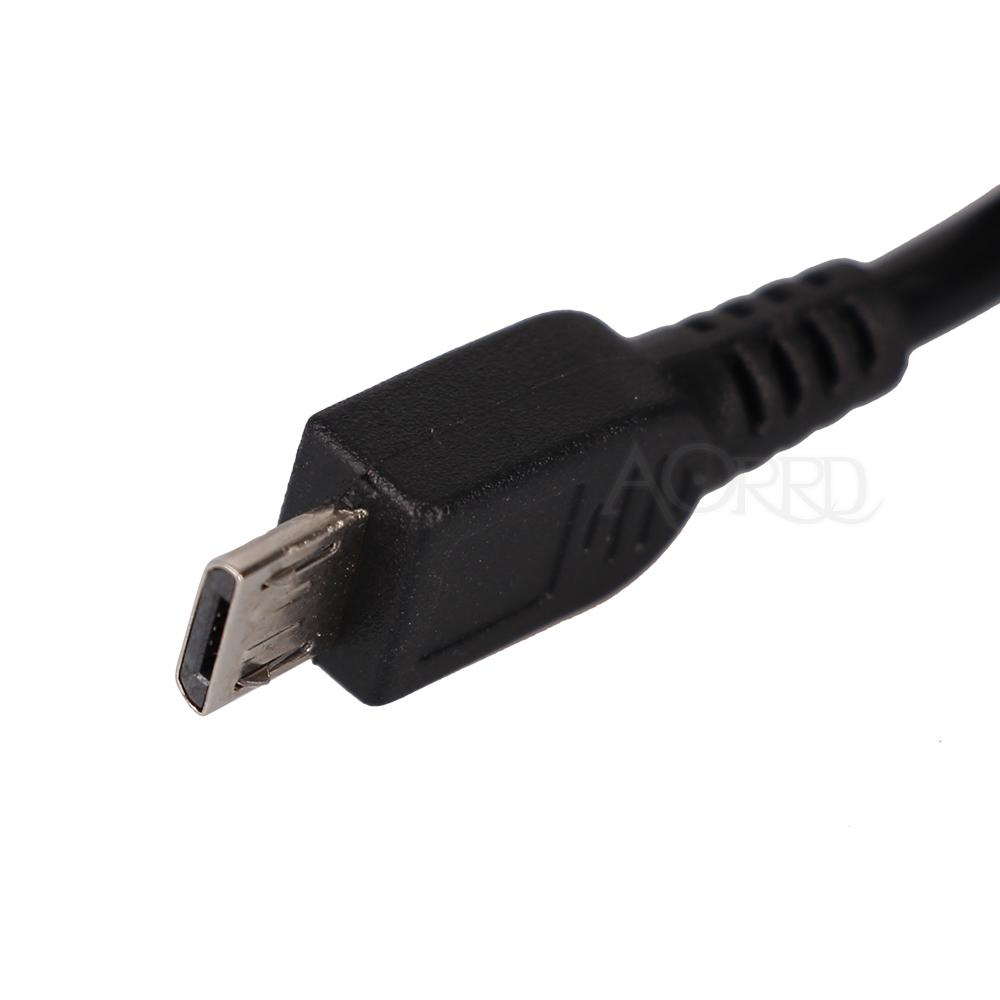
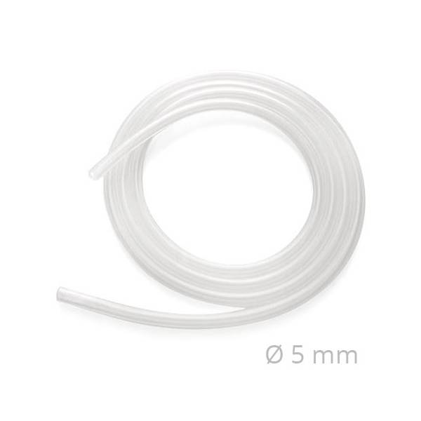

= CheAriaTira
https://www.cheariatira.it/[www.cheariatira.it]
:doctype: book
:imagesdir: ./doc/img
:title-logo-image: image:che-aria-tira.png[align="center"]
:toc: left
:toclevels: 3
:sectnums:
:sectanchors:
:sectlinks:
:sectnumlevels: 5
:icons: font
:docinfo:
:experimental:

== Introduzione
Obiettivo di questo capitolo e' mettere in grado chiunque di potersi costruire una centralina per il rilevamento delle polveri sottili pm2.5 e pm10.

=== Componenti
Per costruire una centralina e' necessario avere i seguenti componenti elettronici:

==== Sensore
http://inovafitness.com/en/a/chanpinzhongxin/95.html[SDS011]  
è il sensore che abbiamo scelto confrontando svariati sensori simili. Il suo compito compito è di restituire 2 numeri corrispondenti al pm2.5 e pm10. Puo' essere acquistato ad esempio su https://www.ebay.it/sch/i.html?_from=R40&_sacat=0&LH_BIN=1&_nkw=sds011&rt=nc&LH_PrefLoc=2[ebay] , https://www.amazon.it/s/field-keywords=sds011[amazon], https://it.aliexpress.com/wholesale?SearchText=sds011[aliexpress]

.Sensore SDS011
image::images/sds011-large.png[]

==== Controllore 
https://wiki.wemos.cc/products:d1:d1_mini[Wemos D1 mini]
e' il controllore. Il suo compito è di leggere i dati dal sensore e di invialrli via wifi al server centrale Puo' essere acquistato ad esempio su https://www.ebay.it/sch/i.html?_from=R40&_sacat=0&LH_BIN=1&_nkw=wemos+d1+mini&rt=nc&LH_PrefLoc=2[ebay] , https://www.amazon.it/s/field-keywords=wemos+d1+mini[amazon], https://it.aliexpress.com/wholesale?SearchText=wemos+d1+mini[aliexpress]

.Controllore  esp8266 wemos-d1-mini
image::images/esp8266-wemos-d1-mini-pinout.png[]

==== Contenitore 
Ad esempio 
GW44004 cassetta di derivazione  dimensioni 100X100X50 - PARETI CON PASSACAVI

.Scatola  GW44004

==== Alimentatore 
Alimentatore da 5v 1A micro usb utilizzato per i cellulari 

.Micro usb  

==== Tubo 
Tubo di 5mm di diametro lungo al massimo 50 cm

.Tubo  

=== Montaggio

